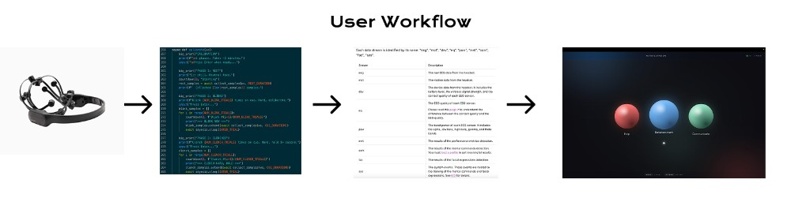

# Manifest




**Problem We Are Solving**  
Late-stage limb-onset ALS patients can lose hand and speech ability faster than the clinical AAC approval timeline moves, creating a communication gap exactly when they need it most. Existing options are often expensive, delayed, and hard to deploy in-home quickly.

**TAM, SAM, Starting Point**  
Our immediate starting segment is roughly 12,000 US limb-onset ALS patients in the late-stage communication-loss window, with Medicare reimbursement already validating $10,000-18,000 spend per patient for eye-tracking AAC. We start with direct-access, no-prescription deployment and expand into broader neurodegenerative and motor-impairment communication markets.

**Solution We Are Building (Investor View)**  
Manifest delivers the same core communication outcome at a $999 hardware entry point, no prescription, and no 6-12 week wait. The differentiator is agentic communication: instead of typing character-by-character, the AI proposes likely messages and the patient confirms with a single selection.

**End-to-End Product Flow**  
User intent is captured from blink/clench facial signals through an Emotiv headset, calibrated per user, then streamed through a BCI bridge to a local UI. From there, an AI agent powers task completion flows (messaging, emergency alert, entertainment), so the patient decides quickly while the system handles composition and execution.

**Why This Is Different**  
Legacy AAC assumes the patient must fully author each message; Manifest shifts that burden to contextual AI inference while preserving patient control over final selection. This changes communication from slow text construction to low-effort intent confirmation.

## Run This Repo

### Hardware Needed
- Emotiv headset (configured in Emotiv Launcher)
- Mac laptop/desktop (for AppleScript-based Contacts/iMessage flow)

### Software Needed
- Python 3.10+
- Emotiv Launcher running with headset paired
- Internet access for Claude/Spotify features

### Setup
```bash
cd /path/to/manifest_hackathon
python3 -m venv .venv
source .venv/bin/activate
pip install aiohttp websockets
```

### `.env` File
Create `.env` in repo root:

```env
EMOTIV_CLIENT_ID=your_emotiv_client_id
EMOTIV_CLIENT_SECRET=your_emotiv_client_secret
```

Optional (for AI + Spotify flows):

```env
SPOTIFY_CLIENT_ID=your_spotify_client_id
SPOTIFY_CLIENT_SECRET=your_spotify_client_secret
SPOTIFY_REDIRECT_URI=http://localhost:8766/spotify/callback
```

### Run Commands
Terminal 1 (BCI bridge):
```bash
python3 bci_bridge.py
```

Terminal 2 (agent API, with Anthropic key in terminal):
```bash
export ANTHROPIC_API_KEY="your_key_here"
python3 agent.py
```

Terminal 3 (serve UI):
```bash
python3 -m http.server 8080
```

Open: `http://localhost:8080/web/index.html`
